<p align="center">
  
</p>

<p align="center">
  <picture>
    <source media="(prefers-color-scheme: dark)" srcset="https://readme-typing-svg.herokuapp.com?font=Fira+Code&weight=700&size=40&duration=3000&pause=1000&color=00FF88&center=true&vCenter=true&width=500&lines=PHISHPULSE+v1.0;Advanced+Social+Engineering+Suite;Instagram+|+Facebook+|+TikTok;RReal-Time+Intelligence+Platform" />
    <source media="(prefers-color-scheme: light)" srcset="https://readme-typing-svg.herokuapp.com?font=Fira+Code&weight=700&size=40&duration=3000&pause=1000&color=009944&center=true&vCenter=true&width=500&lines=PHISHPULSE+v1.0;Advanced+Social+Engineering+Suite;Instagram+|+Facebook+|+TikTok;Real-Time+Intelligence+Platform" />
    
  </picture>
</p>

<p align="center">
  <a href="https://github.com/Athexblackhat/PhishPulse/releases">
    
  </a>
  <a href="https://github.com/Athexblackhat/PhishPulse/blob/main/LICENSE">
    
  </a>
  <a href="https://www.python.org/">
    
  </a>
  <a href="https://www.php.net/">
    
  </a>
  <a href="#">
    
  </a>
  <a href="#">
    
  </a>
</p>

<p align="center">
  <a href="https://github.com/Athexblackhat/PhishPulse/stargazers">
    
  </a>
  <a href="https://github.com/Athexblackhat/PhishPulse/network/members">
    
  </a>
  <a href="https://github.com/Athexblackhat/PhishPulse/watchers">
    
  </a>
</p>

<br />

---

## 📑 Table of Contents

<details open>
<summary><b>Click to expand/collapse</b></summary>

1. [Overview](#-overview)
2. [Features](#-features)
3. [Architecture](#-architecture)
4. [System Design](#-system-design)
5. [Installation](#-installation)
6. [Configuration](#-configuration)
7. [Usage Guide](#-usage-guide)
8. [Dashboard Guide](#-dashboard-guide)
9. [API Reference](#-api-reference)
10. [Security](#-security)
11. [Deployment](#-deployment)
12. [Troubleshooting](#-troubleshooting)
13. [Contributing](#-contributing)
14. [Disclaimer](#-disclaimer)
15. [License](#-license)
16. [Credits](#-credits)

</details>

---

## 📖 Overview

### What is PhishPulse?

PhishPulse is a **comprehensive security research framework** designed for authorized penetration testing and security assessments. It provides a unified interface for testing social media authentication mechanisms across multiple platforms with real-time verification, session capture, and intelligence gathering capabilities.

### Why PhishPulse?

| Traditional Tools | PhishPulse v1.0 |
|-------------------|-----------------|
| Single platform support | **3 platforms** (IG, FB, TT) |
| No real-time feedback | **Live terminal + dashboard** |
| Manual data collection | **Automated JSON storage** |
| Basic logging | **Structured intelligence** |
| No notifications | **Telegram + WhatsApp + Discord** |
| Static reporting | **Animated analytics dashboard** |
| Single session | **Multi-user concurrent tracking** |

### Key Statistics

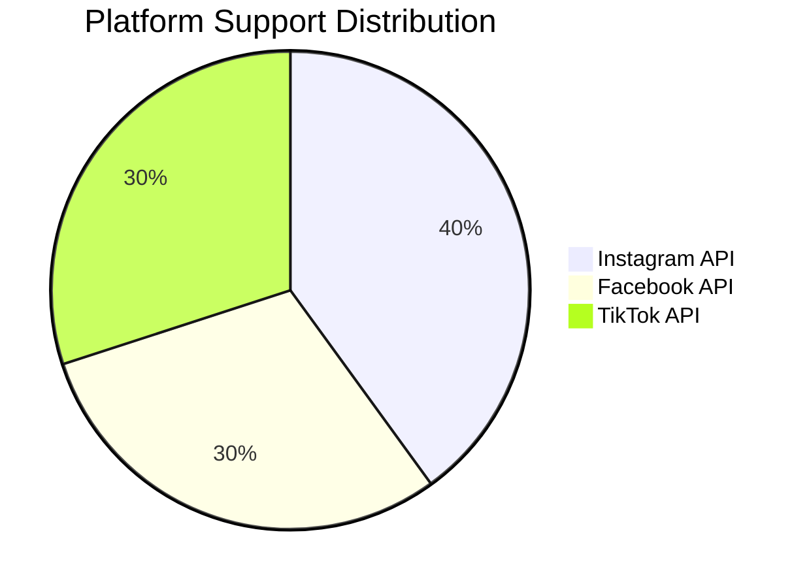

## Dashboard Features

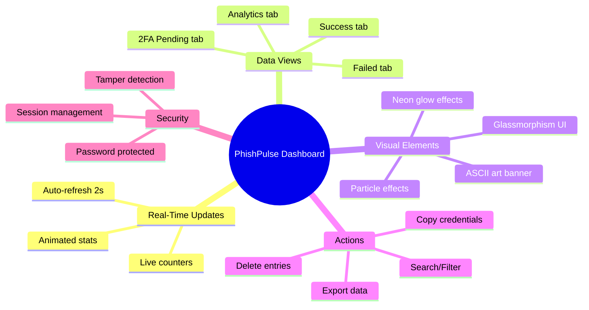

## 🏗️ Architecture

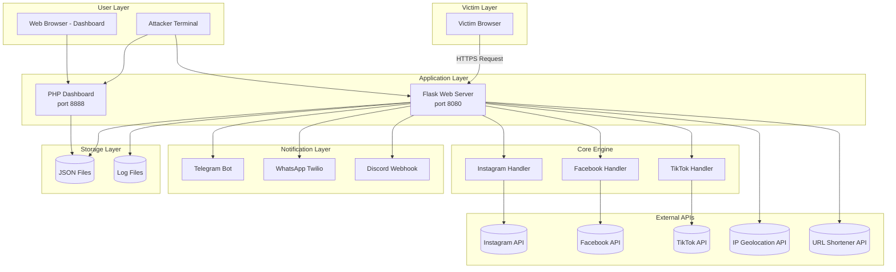

## Component Interaction Diagram

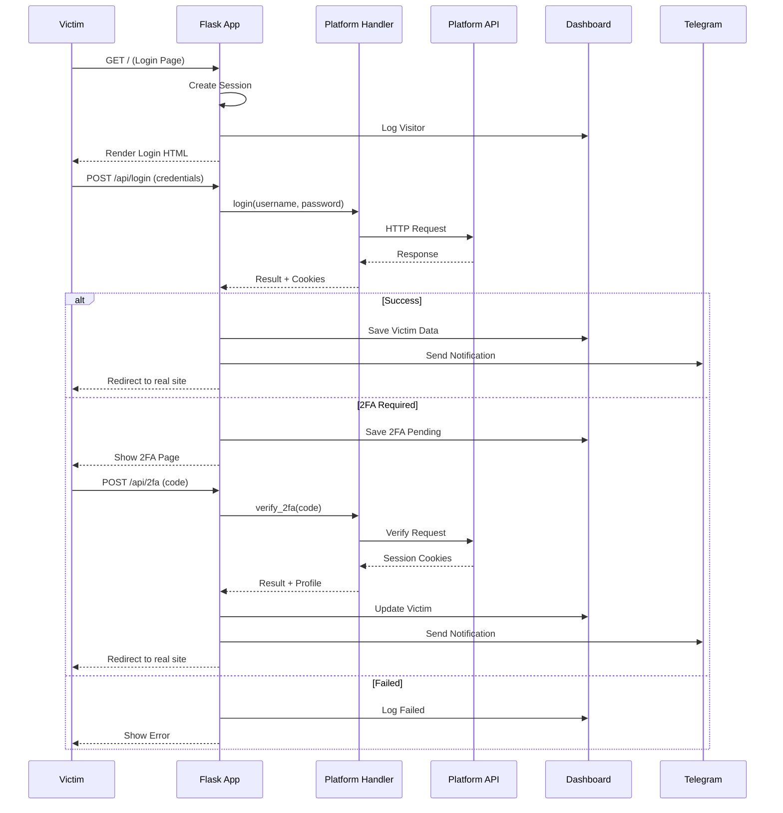

## Request Processing Pipeline

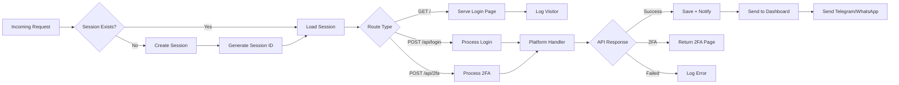

## Data Storage Schema

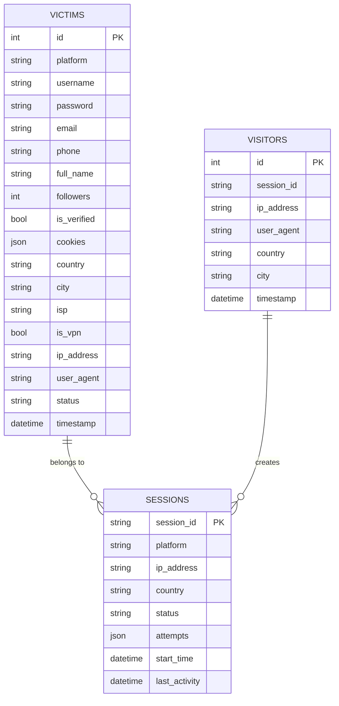

## Quick Install

```
git clone https://github.com/Athexblackhat/PhishPulse.git
cd PhishPulse
chmod +x *
./run.sh
```

## Manual Install

### Linux (Ubuntu/Debian)

```
sudo apt update && sudo apt upgrade -y
sudo apt install -y python3 python3-pip php-cli php-json php-curl git curl
git clone https://github.com/Athexblackhat/PhishPulse.git
cd PhishPulse
pip3 install -r requirements.txt
cp .env.example .env
bash run.sh
```

## Dependency Tree
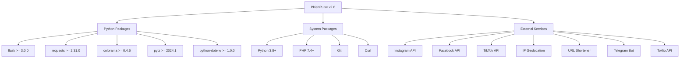
## Configuration Flow
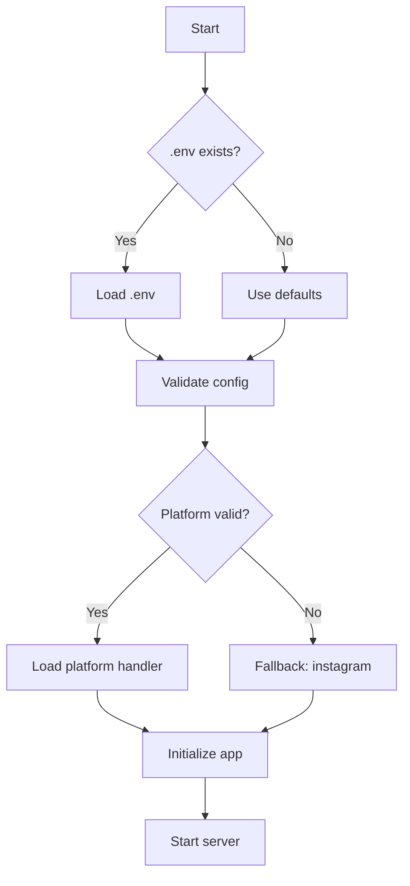
## Platform-Specific Features

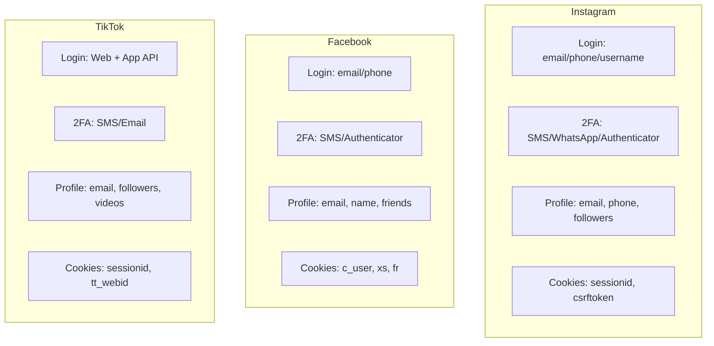

## 📊 Dashboard Guide

```
# Terminal
bash run.sh

# Terminal 2: PHP Dashboard
php -S localhost:8888 -t dashboard/
```
Access: http://localhost:8888/dashboard.php
Password: athex123

## Dashboard Features

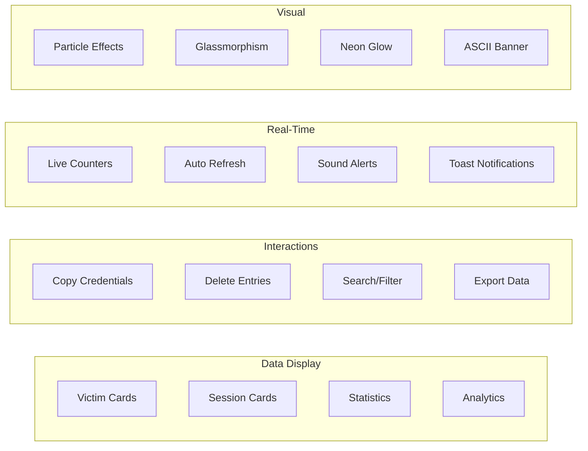

## Security Layers

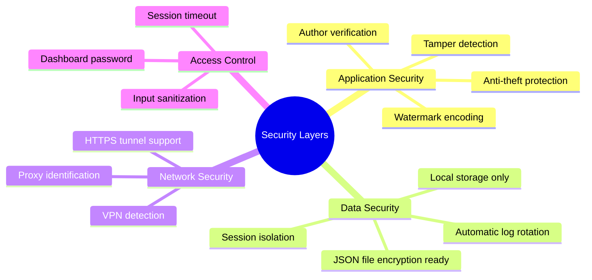

## 🚀 Deployment

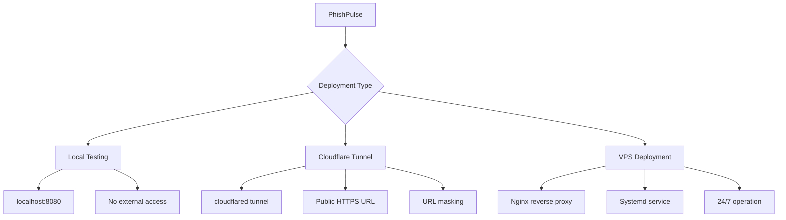

## VPS Deployment
```
# SSH into VPS
ssh root@your-vps-ip

# Install dependencies
apt update && apt install -y python3 python3-pip php-cli nginx git

# Clone repository
git clone https://github.com/Athexblackhat/PhishPulse.git /opt/phishpulse
cd /opt/phishpulse

# Install Python packages
pip3 install -r requirements.txt

# Create systemd service
cat > /etc/systemd/system/phishpulse.service << 'EOF'
[Unit]
Description=PhishPulse Service
After=network.target

[Service]
Type=simple
WorkingDirectory=/opt/phishpulse
Environment=PHISH_PLATFORM=instagram
Environment=PORT=8080
ExecStart=/usr/bin/python3 /opt/phishpulse/app.py
Restart=always
RestartSec=10

[Install]
WantedBy=multi-user.target
EOF

# Start service
systemctl daemon-reload
systemctl enable phishpulse
systemctl start phishpulse
```


## 👤 Author

<table> <tr> <td align="center"> <a href="https://github.com/Athexblackhat">  <br /> <sub><b>ATHEX BLACK HAT</b></sub> </a> <br /> <a href="https://github.com/Athexblackhat" title="GitHub">🐙 GitHub</a> </td> </tr> </table>
